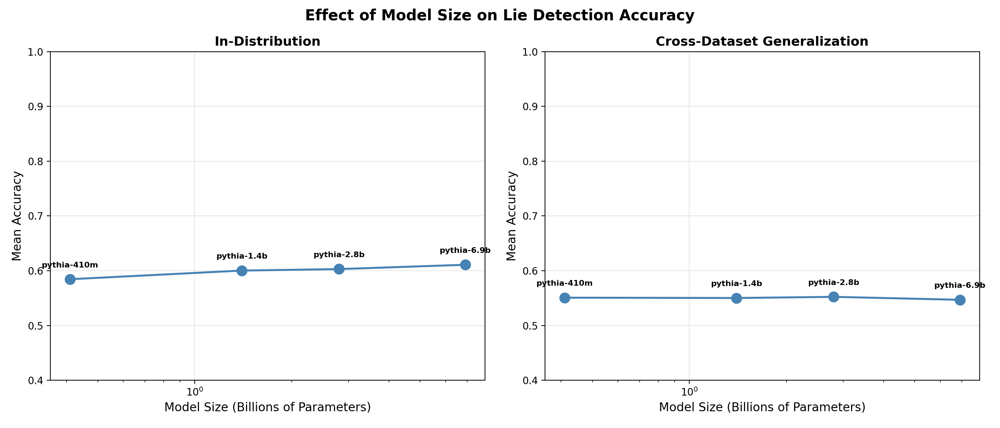
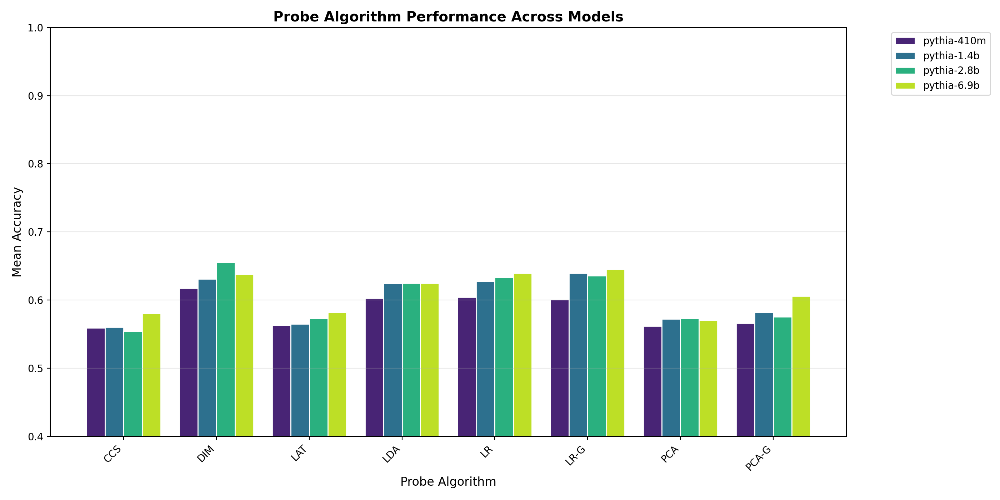
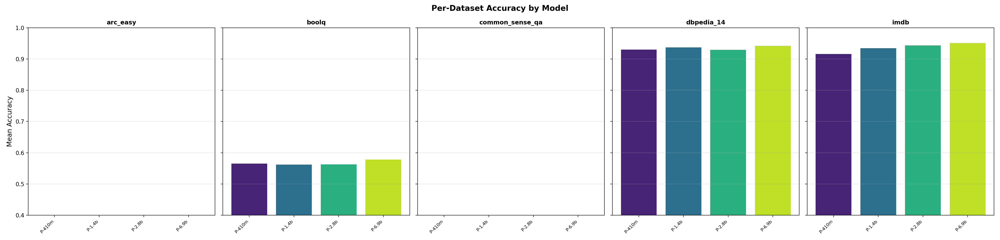
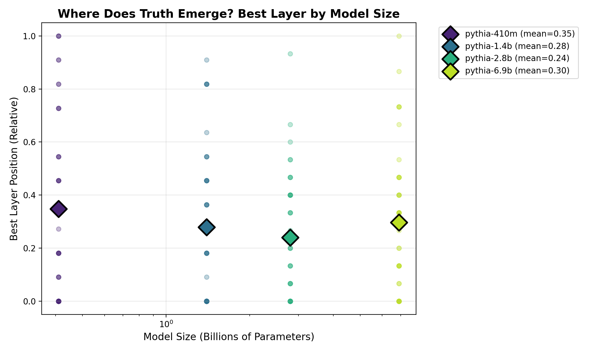

# Multi-Model LLM Lie Detection (White-Box)

Testing white-box lie detection across multiple LLM sizes to study how model scale affects internal truth representations.

> **Based on the project by [GeorgeVasile04](https://github.com/GeorgeVasile04/llm_lie_detection_black_vs_white_box)**, which implements both white-box and black-box lie detection methods from the paper *["How Well Do Truth Probes Generalise?"](https://www.lesswrong.com/posts/cmicXAAEuPGqcs9jw)*.
>
> This repository focuses on **testing the white-box approach on models of different sizes** to analyze the impact of parameter count on truth detection accuracy.

## Research Question

**Do larger models develop better internal truth representations, detectable by linear probes?**

The original project uses Llama-2-13b-chat (13B parameters). Here we test the same approach on smaller models (Pythia family: 0.4B to 6.9B) and larger models (Gemma family: 4B to 27B) to see if accuracy scales with model size.

## Results — Local Experiments (Pythia Family, CPU)

| Model | Parameters | In-Dist Accuracy | Cross-Dataset Acc | Best Algorithm | Best Layer |
|-------|-----------|-------------------|-------------------|----------------|------------|
| Pythia-410m | 0.41B | 58.4% | 55.1% | DIM | 4/22 |
| Pythia-1.4b | 1.4B | 60.0% | 55.0% | LR-G | 18/22 |
| Pythia-2.8b | 2.8B | 60.3% | 55.2% | DIM | 14/30 |
| Pythia-6.9b | 6.9B | 61.1% | 54.7% | LR-G | 16/30 |

### Key Findings (Pythia)

- Modest improvement with model size: 58.4% (0.4B) → 61.1% (6.9B)
- Classification tasks (IMDB, DBpedia) work well even for small models (~92-95%)
- Knowledge tasks (ARC Easy, CommonSenseQA) remain poor across all sizes
- Suggests **instruction tuning matters more than raw model size** for truth representation

### Comparison Figures

<p align="center">
  
  
</p>
<p align="center">
  
  
</p>

## Results — Google Colab (Large Models)

A self-contained Colab notebook is included for testing on larger models with GPU:

| Model | Parameters | GPU Required | Status |
|-------|-----------|-------------|--------|
| Gemma 3 4B | 4B | T4 (free) | Ready to test |
| Gemma 3 12B | 12B | T4 (free) | Ready to test |
| Gemma 3 27B | 27B | T4 (free, 4-bit) | Ready to test |

[](https://colab.research.google.com/github/imadsharof/llm_multi_model_lie_detection/blob/main/Colab_Experiment.ipynb)

## Method

1. **Extract activations**: Feed true/false statement pairs through the model, capture hidden states at each transformer layer using forward hooks
2. **Train probes**: Train 8 different linear probe algorithms on the activations to find "truth directions"
3. **Evaluate**: Test in-distribution and cross-dataset generalization

### Probe Algorithms

| Algorithm | Supervised | Subject-Removed |
|-----------|-----------|-----------------|
| DIM (Difference-in-Means) | Yes | No |
| LDA | Yes | No |
| LR (Logistic Regression) | Yes | No |
| LR-G | Yes | Yes |
| PCA | No | No |
| LAT | No | Statistical |
| PCA-G | No | Yes |
| CCS | No | Yes |

### Datasets

| Dataset | Type | Source |
|---------|------|--------|
| ARC Easy | Knowledge QA | RepE |
| CommonSenseQA | Common sense | RepE |
| BoolQ | Reading comprehension | DLK |
| IMDB | Sentiment | DLK |
| DBpedia 14 | Topic classification | DLK |

## How to Run

### Local experiments (CPU, needs ~14GB RAM for largest model)

```bash
# Clone the original project (needed for the probe library)
git clone https://github.com/GeorgeVasile04/llm_lie_detection_black_vs_white_box.git
cd llm_lie_detection_black_vs_white_box

# Install dependencies
pip install torch transformers datasets pydantic jsonlines jaxtyping overrides scikit-learn matplotlib
pip install "mppr @ git+https://github.com/mishajw/mppr.git@main"

# Run a single model
python scripts/run_experiment.py --model pythia-410m

# Run all Pythia models
python scripts/run_all.py

# Generate comparison figures
python scripts/compare_models.py
```

### Colab experiments (GPU, for larger models)

1. Open `Colab_Experiment.ipynb` in Google Colab
2. Set runtime to **GPU** (T4)
3. Run all cells

## Project Structure

```
├── README.md
├── scripts/
│   ├── run_experiment.py      # Main experiment script
│   ├── run_all.py             # Run all Pythia models
│   ├── run_overnight.py       # Overnight batch runner
│   └── compare_models.py      # Cross-model comparison
├── results/
│   ├── pythia-410m/
│   │   ├── results.json
│   │   ├── results.csv
│   │   ├── metadata.json
│   │   └── figures/
│   ├── pythia-1.4b/
│   ├── pythia-2.8b/
│   └── pythia-6.9b/
├── comparison/
│   ├── summary.csv
│   ├── all_results.csv
│   ├── model_size_vs_accuracy.png
│   ├── algorithm_by_model.png
│   ├── per_dataset_comparison.png
│   ├── best_layer_by_model_size.png
│   └── layer_accuracy_comparison.png
└── Colab_Experiment.ipynb     # Self-contained notebook for large models
```

## Credits

This project is an extension of [**llm_lie_detection_black_vs_white_box**](https://github.com/GeorgeVasile04/llm_lie_detection_black_vs_white_box) by **GeorgeVasile04**, which implements both white-box and black-box lie detection approaches based on:

- **Paper**: [How Well Do Truth Probes Generalise?](https://www.lesswrong.com/posts/cmicXAAEuPGqcs9jw) (LessWrong)
- **White-box method**: Linear probes on internal model activations
- **Black-box method**: Logprob analysis (GPT-3.5)

The original codebase provides the activation extraction pipeline, dataset loading, and probe training algorithms used in this project.
